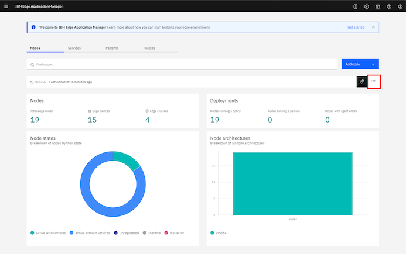
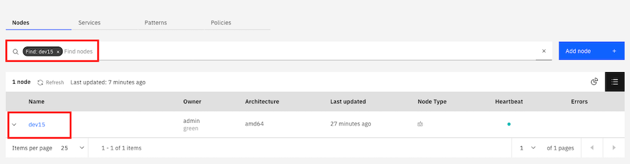
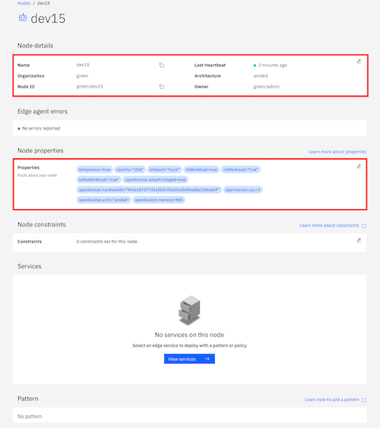

# Install agent on the device to connect to Edge Application Manager

IBM Edge Application manager to manage the edge devices and clusters, you need to install the agent on the device. The pre-requisites for the edge device to be registered as managed node are  
- Edge Device - ubuntu based vm, linux on ARM ( 32bit), Linux on ARM (64bit), macOS
- Docker runtime on the device
- Binaries for the agent
- apikey to communicate with IBM Edge Application Manager
- org-id ( typically the cluster name)  

In this lab environment, a virtual device ( ubuntu 18.04 ) is deployed and ready for the agent installation. This means, docker is installed, the binaries are copied and the api key environment variable is set.

## Validate the binaries

Few parameters are required to run the lab. They will be provided. The parameters are:  
- **username for ssh**
- **password for ssh**
- **target host to ssh along with the port** 
- **IBM Edge Application Manager( IEAM ) Console URL**
- **IEAM console userid**
- **IEAM console password**  

Using the above, ssh to the edge device  
```
ssh coc@xxxxx.coc-ibm.com -p xxxx
```  

Check the files that were copied over.  
```
ls -la

total 35108
drwxr-xr-x 4 coc  coc      4096 Jul 15 20:03 .
drwxr-xr-x 4 root root     4096 Jul 15 19:50 ..
-rw-r--r-- 1 coc  coc       220 Apr  4  2018 .bash_logout
-rw-r--r-- 1 coc  coc      3771 Apr  4  2018 .bashrc
drwx------ 2 coc  coc      4096 Jul 15 20:03 .cache
drwx------ 3 coc  coc      4096 Jul 15 20:03 .gnupg
-rw-r--r-- 1 coc  coc       807 Apr  4  2018 .profile
-rwxr-xr-x 1 coc  sudo      271 Jul 15 19:50 agent-device-install.sh
-rw-r--r-- 1 coc  sudo 35910264 Jul 15 19:50 agentInstallFiles-x86_64-Linux.tar.gz
-rw-r--r-- 1 coc  sudo      641 Jul 15 19:50 policy.json
```  

Check the environment variables.  
```
env | grep -i hzn
HZN_EXCHANGE_USER_AUTH=iamapikey:iMh1DFbf-x5CVbRxiA50kzxCn8h0OIDTz9-Rv_lp0-Vpwqxx
HZN_ORG_ID=green
```  
## Create API key for your user
As, the tutorial env is shared, you have to create api key to register the device so that you can manage the device.   
1. Log in to the cli using your credentials.  
  ```bash
  cloudctl login -a <IEAM URL> -u <IEAM userid>
  ```  
  **Note**: IEAM URL and user credentials are provided to you. For ex:  
  ```bash
  cloudctl login -a https://icp-console.apps.mydomain.com -u myuser -p mypassword -n kube-public
  ```  
  Create the api key.  
  ```bash
  cloudctl iam api-key-create  <userid>-edge-node-apikey -d <userid>-api-key
  ```  
  The output will be similar to  
  ```bash
  Name          myuser-edge-node-apikey   
  Description   myuser-api-key   
  Bound To      crn:v1:icp:private:iam-identity:::IBMid:user:myuser   
  Created At    2020-07-16T17:47+0000   
  API Key       AIh2VqREBZeJsWIiwQzjEtXRNxJ94g0MZjP42E4_xyzA
  ```  
  Make a note of the **API Key** as you need this for the subsequent steps. Update `/etc/environment` to reflect this, using the editor of your choice `vi`/`nano`/`vim`.   

  Ensure that the environment variables reflect the API key that is created.  
  ```bash
  source /etc/environment
  env | grep -i hzn

  HZN_EXCHANGE_USER_AUTH=iamapikey:AIh2VqREBZeJsWIiwQzjEtXRNxJ94g0MZjP42E4_xyzA
  HZN_ORG_ID=green
  ```  
  The *API Key* set in the environment variable should match the *API Key* you created.  

## Install the agent

In the above example, HZN_ORG_ID value is typically the cluster name and will be **provided to you**.

To install the agent run the shell script **agent-device-install.sh**.  
```
./agent-device-install.sh 

agent-install.sh
2020-07-15 20:17:45 HZN_EXCHANGE_URL: https://icp-console.apps.green.coc-ibm.com/edge-exchange/v1/ (from agent-install.cfg)
2020-07-15 20:17:45 HZN_FSS_CSSURL: https://icp-console.apps.green.coc-ibm.com/edge-css/ (from agent-install.cfg)
2020-07-15 20:17:45 HZN_ORG_ID: green (from environment)
2020-07-15 20:17:45 HZN_EXCHANGE_NODE_AUTH: (not found)
2020-07-15 20:17:45 HZN_EXCHANGE_USER_AUTH: ****** (from environment)
2020-07-15 20:17:45 NODE_ID: (not found)
2020-07-15 20:17:45 CERTIFICATE: (not found)
2020-07-15 20:17:45 HZN_MGMT_HUB_CERT_PATH: (not found)
2020-07-15 20:17:45 HZN_EXCHANGE_PATTERN: (not found)
2020-07-15 20:17:45 HZN_NODE_POLICY: policy.json (from environment)
Installation packages location: .
Ignore package tree: true
Node policy: policy.json
NODE_ID=
Image Full Path On Edge Cluster Registry: 
Internal URL for Edge Cluster Registry: 
2020-07-15 20:17:45 Node type is: device
2020-07-15 20:17:45 Detection results: OS is linux, distribution is ubuntu, release is bionic, architecture is amd64
2020-07-15 20:17:45 Installing agent on ubuntu, version bionic, architecture amd64
+ apt install -y jq
Reading package lists... Done
Building dependency tree       
Reading state information... Done
The following package was automatically installed and is no longer required:
  grub-pc-bin
Use 'sudo apt autoremove' to remove it.
The following additional packages will be installed:
  libjq1 libonig4
The following NEW packages will be installed:
  jq libjq1 libonig4
0 upgraded, 3 newly installed, 0 to remove and 25 not upgraded.
Need to get 276 kB of archives.
After this operation, 930 kB of additional disk space will be used.
Get:1 http://archive.ubuntu.com/ubuntu bionic/universe amd64 libonig4 amd64 6.7.0-1 [119 kB]
Get:2 http://archive.ubuntu.com/ubuntu bionic/universe amd64 libjq1 amd64 1.5+dfsg-2 [111 kB]
Get:3 http://archive.ubuntu.com/ubuntu bionic/universe amd64 jq amd64 1.5+dfsg-2 [45.6 kB]
Fetched 276 kB in 1s (340 kB/s)
Selecting previously unselected package libonig4:amd64.
(Reading database ... 67509 files and directories currently installed.)
Preparing to unpack .../libonig4_6.7.0-1_amd64.deb ...
Unpacking libonig4:amd64 (6.7.0-1) .........................................................................................................................................] 
Selecting previously unselected package libjq1:amd64........................................................................................................................] 
Preparing to unpack .../libjq1_1.5+dfsg-2_amd64.deb ...
Unpacking libjq1:amd64 (1.5+dfsg-2) ...#################....................................................................................................................] 
Selecting previously unselected package jq.################################.................................................................................................] 
Preparing to unpack .../jq_1.5+dfsg-2_amd64.deb ...
Unpacking jq (1.5+dfsg-2) ...########################################################.......................................................................................] 
Setting up libonig4:amd64 (6.7.0-1) ...#################################################################....................................................................] 
Setting up libjq1:amd64 (1.5+dfsg-2) ...###################################################################################.................................................] 
Setting up jq (1.5+dfsg-2) ...#################################################################################################################.............................] 
Processing triggers for man-db (2.8.3-2ubuntu0.1) ...#############################################################################################################..........] 
Processing triggers for libc-bin (2.27-3ubuntu1) ...
2020-07-15 20:17:49 hzn not found, installing it...
+ set +e
+ dpkg -i ./bluehorizon_2.26.12~ppa~ubuntu.bionic_all.deb ./horizon-cli_2.26.12~ppa~ubuntu.bionic_amd64.deb ./horizon_2.26.12~ppa~ubuntu.bionic_amd64.deb
Selecting previously unselected package bluehorizon.
(Reading database ... 67526 files and directories currently installed.)
Preparing to unpack .../bluehorizon_2.26.12~ppa~ubuntu.bionic_all.deb ...
Unpacking bluehorizon (2.26.12~ppa~ubuntu.bionic) ...
Selecting previously unselected package horizon-cli.
Preparing to unpack .../horizon-cli_2.26.12~ppa~ubuntu.bionic_amd64.deb ...
Unpacking horizon-cli (2.26.12~ppa~ubuntu.bionic) ...
Selecting previously unselected package horizon.
Preparing to unpack .../horizon_2.26.12~ppa~ubuntu.bionic_amd64.deb ...
Unpacking horizon (2.26.12~ppa~ubuntu.bionic) ...
Setting up horizon-cli (2.26.12~ppa~ubuntu.bionic) ...
Setting up horizon (2.26.12~ppa~ubuntu.bionic) ...
Setting up bluehorizon (2.26.12~ppa~ubuntu.bionic) ...
Created symlink /etc/systemd/system/multi-user.target.wants/horizon.service → /lib/systemd/system/horizon.service.
Processing triggers for man-db (2.8.3-2ubuntu0.1) ...
+ set -e
2020-07-15 20:17:53 Resolving any dependency errors...
+ apt update
Hit:1 https://download.docker.com/linux/ubuntu bionic InRelease
Hit:2 http://archive.ubuntu.com/ubuntu bionic InRelease                                                                             
Get:3 http://security.ubuntu.com/ubuntu bionic-security InRelease [88.7 kB]
Get:4 http://archive.ubuntu.com/ubuntu bionic-updates InRelease [88.7 kB]           
Get:5 http://archive.ubuntu.com/ubuntu bionic-backports InRelease [74.6 kB]
Get:6 http://archive.ubuntu.com/ubuntu bionic-updates/main amd64 Packages [1010 kB]
Get:7 http://archive.ubuntu.com/ubuntu bionic-updates/universe amd64 Packages [1091 kB]
Fetched 2354 kB in 2s (1392 kB/s)                         
Reading package lists... Done
Building dependency tree       
Reading state information... Done
25 packages can be upgraded. Run 'apt list --upgradable' to see them.
+ apt-get install -y -f
Reading package lists... Done
Building dependency tree       
Reading state information... Done
The following package was automatically installed and is no longer required:
  grub-pc-bin
Use 'sudo apt autoremove' to remove it.
0 upgraded, 0 newly installed, 0 to remove and 25 not upgraded.
2020-07-15 20:18:00 Registering node with existing id 
+ '[' -z agent-install.crt ']'
+ [[ a != \/ ]]
+ set -x
+ sudo cp agent-install.crt /etc/horizon/agent-install.crt
+ systemctl restart horizon.service
2020-07-15 20:18:00 the service is not ready, will retry in 1 second
2020-07-15 20:18:01 The service is ready
2020-07-15 20:18:01 Generated node token is quuNE9s8TNIfBg0lRY6Q91hCqkdKfIoVb21RxoATNaH0Q
2020-07-15 20:18:01 Registering node...
+ hzn register -m dev15 -o green -u iamapikey:iMh1DFbf-5CVbRxiA50kzCn8h0OIDTz9-Rv_lp0-Vpwq -n dev15:quuNE9s8TNIfBg0lRY6Q91hCqkdKfIoVb21RxoATNaH0Q --policy policy.json
Horizon Exchange base URL: https://icp-console.apps.green.coc-ibm.com/edge-exchange/v1
Updating node token...
Will proceeed with the given node policy.
Updating the node policy...
Initializing the Horizon node with node type 'device'...
Warning: no input file was specified. This is only valid if none of the services need variables set (including GPS coordinates).
However, if there is 'userInput' specified in the node already in the Exchange, the userInput will be used.
Changing Horizon state to configured to register this node with Horizon...
Horizon node is registered. Workload agreement negotiation should begin shortly. Run 'hzn agreement list' to view.
```  

## Check if the device is registered to IBM Edge Application Manager  

You can valid if the device is registered. By default, the device name will be registered as the hostname of the device. On the device, you run the command `hzn node list` to find the status of the device.  
```
hzn node list

{
  "id": "dev15",
  "organization": "green",
  "pattern": "",
  "name": "dev15",
  "nodeType": "device",
  "token_last_valid_time": "2020-07-15 20:18:02 +0000 UTC",
  "token_valid": true,
  "ha": false,
  "configstate": {
    "state": "configured",
    "last_update_time": "2020-07-15 20:18:02 +0000 UTC"
  },
  "configuration": {
    "exchange_api": "https://icp-console.apps.green.coc-ibm.com/edge-exchange/v1/",
    "exchange_version": "2.30.0",
    "required_minimum_exchange_version": "2.23.0",
    "preferred_exchange_version": "2.23.0",
    "mms_api": "https://icp-console.apps.green.coc-ibm.com/edge-css",
    "architecture": "amd64",
    "horizon_version": "2.26.12"
  }
}
```  

In the above *json* output, you will find that the state is **configured** in the config state section.

You also can validate this device in the dashboard of IBM Edge Application Manager. Log in to the console using the **credentails** and the **url** provided to you.  


Select the highlighted icon to view the list of devices. In the search bar, type the device name ( same as teh hostname of the device assigned to you).  
  

Select the device to view the details of the device.  
  

You can validate the properties listed in the device details match the **policy.json** on your device.

## Create service key

To publish or manage service definition. service policy, service patterns, business policy etc., you need a service key.  
```bash
hzn key create IBM <your email>
   - In this IBM is the orgID. 
``` 

## Unregister the device

To continue with rest of the lab, unregister the device. In the **ssh** session, you can unregister teh device with the command `hzn unregister -f`.  
```
hzn unregister -f

Unregistering this node, cancelling all agreements, stopping all workloads, and restarting Horizon...
Waiting for Horizon node unregister to complete: No Timeout specified ...
Checking the node configuration state...
Horizon node unregistered. You may now run 'hzn register ...' again, if desired.
```  

<table align="center">
<tr>
  <td align="left" width="9999"><a href="../README.md">Previous - Introduction </a> </td>
  <td align="right" width="9999"><a href="preconditions.md">Next - Preconditions ... </a> </td>
</tr>
</table>


