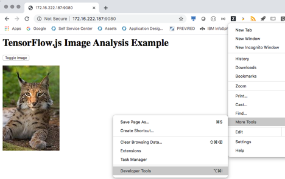
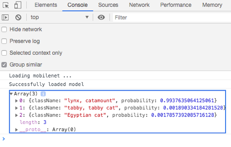
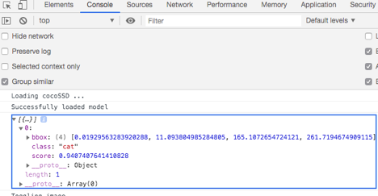
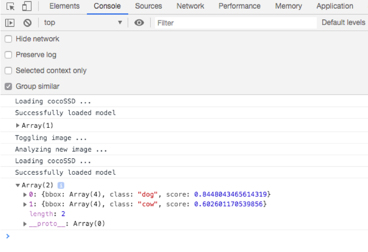

## <a id=using-image-mms-pattern></a> Using the ML Model MMS Example Edge Service with Deployment Policy


Make sure you have completed the precondition steps before starting this session. Particularly verifying that service and deployment policies have been configured and are compatible with this node policy.

1. Register your edge node with Horizon to use policy:

```bash
hzn register --policy=horizon/node.policy.json
```

2. The edge device will make an agreement with one of the Horizon agreement bots (this typically takes about 15 seconds). Repeatedly query the agreements of this device until the `agreement_finalized_time` and `agreement_execution_start_time` fields are filled in:

```bash
hzn agreement list
```

3. After the agreement is made, list the docker container edge service that has been started as a result:

``` bash
sudo docker ps
```

4. See the `image.demo-mms` service output:

  on **Linux**:

  ```bash
  sudo tail -f /var/log/syslog | grep DEBUG
  ```

  on **Mac**:

  ```bash
  sudo docker logs -f $(sudo docker ps -q --filter name=DEBUG)
  ```
5. Open Chrome and navigate to HTTP://HOSTNAME:9080 where HOSTNAME=Node Host Name or IP address


6. Open the Web Console in More Tools \ Developer tools



7. After a few seconds, you will see a message indicating the initial model was load, click on the picture or Toggle image button to see the Image analysis results



8. Notice the difference in the model results between the two example pictures, you will observe less precision in pictures with multiple objects. Let's see how to update the ML model running on the edge node using MMS.


9. Before publishing the new ML model, review the metadata needed to update ML models using MMS publish capabilities

[MMS Object JSON example](/mms/object.json)

10. Publish the `index.js` file as a new MMS object to update the existing ML model with:
```bash
hzn mms object publish -m mms/object.json -f index.js
```

11. View the published MMS object:
```bash
hzn mms object list -t model -i index.js -d
```

A few seconds after the `status` field changes to `delivered` you will see in the console the output of the image detection service change from **loading MobileNet...**

to **Loading cocoSSD ...**



12. Next, test with the other image, you will observe better results in images with multiple objects:




Optional:

13. Delete the published mms object with:
```bash
hzn mms object delete -t model --id index.js
```

14. Unregister your edge node, which will also stop the `image.demo-mms` service:

```bash
hzn unregister
```

15. Remove the business policy:

```bash
hzn exchange business removepolicy image.demo-mms.policy
```

16. Remove the service policy:

```bash
hzn exchange service remove image.demo-mms_1.0.0_amd64
```

